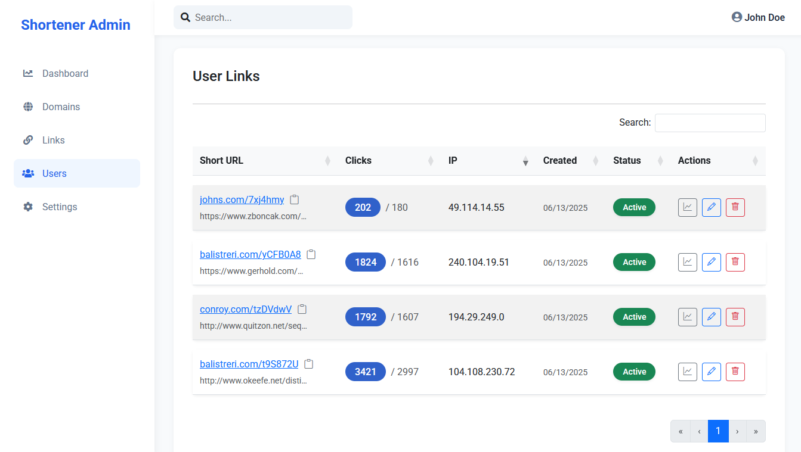

# 🔗 Laravel Short Link Service

## URL shortening service with analytics built with modern Laravel.

[](https://php.net/)
[](https://laravel.com)

## ✨ Features

### Core Functionality
- **URL Shortening**: Create short memorable links
- **Multi-domain**: Support for custom domains
- **Analytics**: Track clicks, locations, devices
- **User Management**: Roles and permissions

### Technical Highlights
- Service Layer architecture
- XSS/PHP injection protection
- Comprehensive test coverage

## 🖼️ Screenshots

### User side
| Home | Links Management | Analytics |
|-----------|-----------------|-----------|
|  |  |  |

### Admin side
| Dashboard | Link Management | Analytics | User Links Managment |
|-----------|-----------------|-----------|----------------------|
|  |  |  | 

## 🛠️ Technology Stack

**Backend**:
- Laravel 12
- PHP 8.2+
- MySQL/PostgreSQL
- Cache facade

**Frontend**:
- HTML5
- CSS
- jQuery
- Vite
- Responsive design

**Security**:
- [Spatie Permissions](https://github.com/spatie/laravel-permission)
- Custom validation rules to prevent any malicious injection
- CSRF protection

## Development Standards

### Code Quality
- **PSR-12** coding standards
- **Type declarations** for all methods and properties
- **SOLID principles** implementation
- **DRY** principle

### Architecture
- **MVC** pattern with thin controllers
- **Service Layer** for business logic
- **Dependency Inversion Principle**
- **Inversion of Control Principle**
- **Dependency Injection** throughout

### Testing
- **PHPUnit** for unit and feature tests
- **Database transactions** in tests
- **Mocking** external dependencies

### Documentation
- **PHPDoc** for all methods

## 🚀 Installation

```bash
# Clone repository
git clone https://github.com/svtcore/laravel-short-link-service.git

# Install dependencies
composer install
npm install

# Setup environment
cp .env.example .env
php artisan key:generate

# Run migrations
php artisan migrate:fresh --seed

# Build assets
npm run dev OR npm run build
```

## 📄 License

GPL-3.0 License - see [LICENSE](https://github.com/svtcore/laravel-short-link-service#GPL-3.0-1-ov-file) file for details
